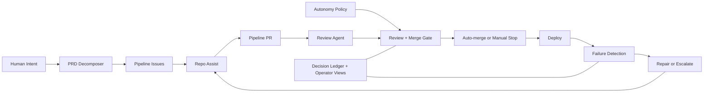

# prd-to-prod

> Turn product requirements into deployed software. Autonomously.

Drop a PRD. The pipeline decomposes it into issues, implements them as PRs,
reviews the code, merges on approval, and deploys. If CI breaks, it fixes itself.

## How it works



## Quick Start (Next.js + Vercel)

### Prerequisites

- GitHub account with Actions enabled
- [gh CLI](https://cli.github.com/) installed
- [gh-aw extension](https://github.com/github/gh-aw) installed: `gh extension install github/gh-aw`

### 1. Create your repo

Click **"Use this template"** → **"Create a new repository"**.

Clone your new repo locally.

### 2. Run bootstrap

```bash
./scripts/bootstrap.sh
```

This creates labels, compiles gh-aw workflows, seeds the repo-memory branch,
and configures repo settings.

### 3. Configure secrets

```bash
# Configure the AI engine (GitHub Copilot, Claude, or Codex)
gh aw secrets bootstrap

# Required for self-healing loop and auto-merge:
# Create a PAT with repo and workflow scopes, then:
gh secret set GH_AW_GITHUB_TOKEN

# For Vercel deployment:
gh secret set VERCEL_TOKEN
gh secret set VERCEL_ORG_ID
gh secret set VERCEL_PROJECT_ID
```

### 4. Configure repo settings

- Enable **Settings → General → Allow auto-merge**
- Create a **branch protection rule** for `main`:
  - Require 1 approving review
  - Require the `review` status check
  - Allow squash merges only

### 5. Submit your first PRD

Create an issue with your product requirements, then comment `/decompose`.

Or drop a PRD file into `docs/prd/` and run:
```bash
gh aw run prd-decomposer
```

## Architecture

See [docs/ARCHITECTURE.md](docs/ARCHITECTURE.md) for the full system design.

See [docs/why-gh-aw.md](docs/why-gh-aw.md) for why this uses GitHub Agentic Workflows.

## Customization

### autonomy-policy.yml

Defines what the AI agents can and cannot do. Edit `allowed_targets` in
each action block to match your application's directory structure.

## Self-Healing Loop

When CI fails on `main`, the pipeline:
1. Creates a `[Pipeline] CI Build Failure` issue
2. `auto-dispatch` triggers `repo-assist`
3. The agent reads failure logs, implements a fix, opens a PR
4. The review agent approves, auto-merge lands the fix
5. Deploy runs on the green main branch

This loop is autonomous — zero human intervention required.

## Secrets Reference

| Secret | Required | Purpose |
|--------|----------|---------|
| `GH_AW_GITHUB_TOKEN` | Yes | PAT for auto-merge and workflow dispatch (bypasses GitHub anti-cascade) |
| `VERCEL_TOKEN` | Yes | Vercel deployment token |
| `VERCEL_ORG_ID` | Yes | Vercel organization ID |
| `VERCEL_PROJECT_ID` | Yes | Vercel project ID |

## Variables Reference

| Variable | Required | Purpose |
|----------|----------|---------|
| `PIPELINE_HEALING_ENABLED` | No | Set to `false` to pause autonomous healing |

## License

MIT
